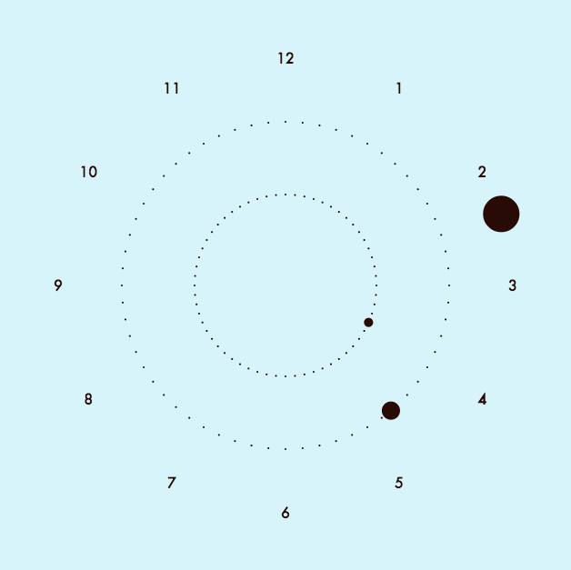

FluxClock
===========

Real-time analog clock that changes color based on the time of day.

##Overview

FluxClock displays the time at the user's current location. The clock cycles through colors based on the time of day. The background color and clock face color are always complementary.

##Built With:

* Node.js
* Express
* HTML 5 Canvas
* AJAX

###Find it here: [http://fluxclock.herokuapp.com/](http://globetweet.herokuapp.com/)

--------------------

### Screenshots:

####4:23 PM

